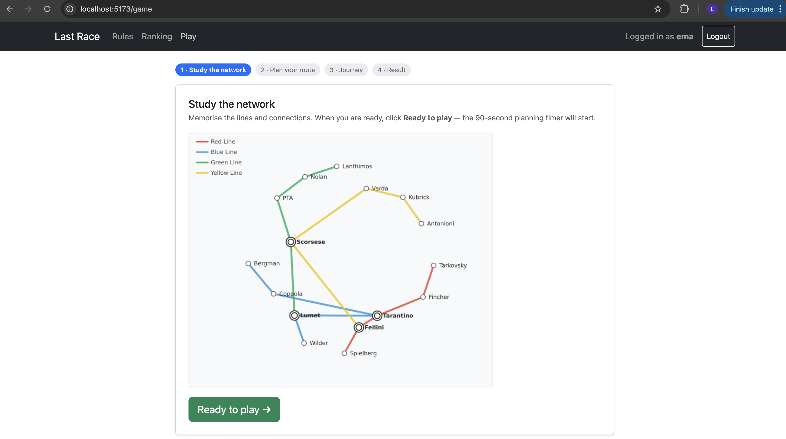
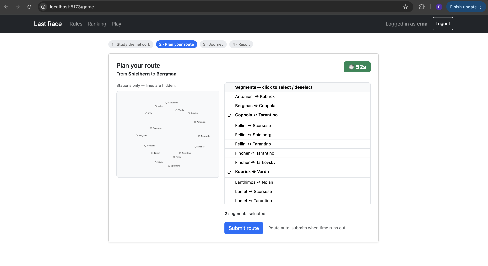
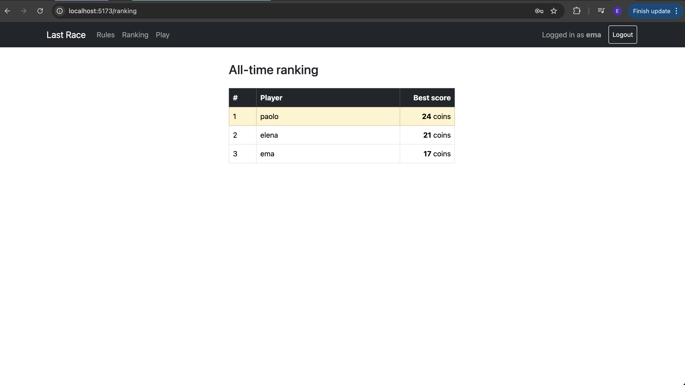

# Exam #1: "Last Race"
## Student: s353234 KOLA EMA 

## React Client Application Routes
 
- Route `/`: public rules/instructions page. Shown to everyone. 
- Route `/login`: login form.
- Route `/game`: the game itself. Internally manages a 4-phases (Setup, Planning, Execution, Result) without changing the URL.
- Route `/ranking`: general ranking page, showing each registered user's best score.
- Route `*`: catch-all 404 page for any unmatched path.

## API Server
### POST `/api/sessions`
 
- Description: Create a new session (login).
- Request body:
```json
{
  "username": "ema",
  "password": "password"
}
```
 
- Response body:
```json
{
  "username": "ema"
}
```
 
- Status codes: `201 Created`, `401 Unauthorized`
---

### GET `/api/sessions/current`
 
- Description: Check whether the user is currently authenticated.
- Request parameters: none
- Response body:
```json
{
  "username": "ema"
}
```
 
- Status codes: `200 OK`, `401 Unauthorized`
---

### DELETE `/api/sessions/current`
 
- Description: Logout the current user.
- Request parameters: none
- Response body: none
- Status codes: `200 OK`
---
### GET `/api/segments`
 
- Description: Retrieve the list of all segments (pairs of connected stations) in the network.
- Request parameters: none
- Response body:
```json
[
  { "station1": "Bergman", "station2": "Coppola" },
  { "station1": "Fellini", "station2": "Scorsese" }
]
```
 
- Status codes: `200 OK`, `401 Unauthorized`, `500 Internal Server Error`
---
### POST `/api/game/start`
 
- Description: Start a new game. Randomly picks a start/destination station pair (minimum distance of 3 segments) and stores it server-side in the session.
- Request body: none
- Response body:
```json
{
  "startStation": "Tarkovsky",
  "endStation": "Antonioni",
  "coins": 20
}
```
 
- Status codes: `200 OK`, `401 Unauthorized`, `500 Internal Server Error`
---


### POST `/api/game/execute`
  Description: Validate the segments selected by the player, reconstruct the walked path, apply a random event to each step, compute the final score, and save the result for the current user — all as one server-side operation. 
- Request body:
```json
{
  "segments": [
    ["Tarkovsky", "Fincher"],
    ["Fincher", "Tarantino"]
  ]
}
```
- Response body (valid route):
```json
{
  "valid": true,
  "steps": [
    {
      "from": "Tarkovsky",
      "to": "Fincher",
      "event": "Helpful driver gave a free tip",
      "effect": 3,
      "coins": 23
    },
    {
      "from": "Fincher",
      "to": "Tarantino",
      "event": "Wrong platform, had to backtrack",
      "effect": -2,
      "coins": 21
    }
  ],
  "finalScore": 21
}
```
 
- Response body (invalid route):
```json
{
  "valid": false,
  "finalScore": 0,
  "reason": "Selected segments do not form a single connected path"
}
```
 
- Status codes: `200 OK`, `400 Bad Request`, `401 Unauthorized`, `500 Internal Server Error`
---
 
### GET `/api/ranking`
 
- Description: Retrieve the ranking based on each user's best score across all their games, sorted from highest to lowest. 
- Request parameters: none
- Response body:
```json
[
  { "username": "paolo", "bestScore": 24 },
  { "username": "elena", "bestScore": 21 }
]
```
 
- Status codes: `200 OK`, `401 Unauthorized`, `500 Internal Server Error`

## Database Tables

- Table `users` - username, passwordHash, salt
- Table `graph` - id, line, station1, station2
- Table `events` - id, description, effect
- Table `games` - id, username, score, startStation, endStation

## Main React Components
- `App` (in `App.jsx`): root component, holds the logged-in user in `UserContext`, and declares all routes inside a shared `Layout`.
- `Header` (in `Header.jsx`): navigation bar. Shows Rules/Ranking/Play links and Login/Logout depending on auth state.
- `HomePage` (in `Homepage.jsx`): public rules and instructions page, with no network map, reachable by anyone at any time.
- `LoginPage` (in `LoginPage.jsx`): login form.
- `RankingPage` (in `RankingPage.jsx`): displays the best-score leaderboard for registered users; 
- `GamePage` (in `GamePage.jsx`): orchestrates the 4 game phases (Setup, Planning, Execution, Result) 
- `SetupPhase` (in `SetupPhase.jsx`): shows the full network map (with lines) and a "Ready to play" button. 
- `PlanningPhase` (in `PlanningPhase.jsx`): shows the stations-only map and the full segment list; lets the player toggle segments on/off in any order within the 90-second countdown, then submits (manually or automatically on timeout).
- `ExecutionPhase` (in `ExecutionPhase.jsx`): calls the execution API, then reveals the resulting steps one at a time as the player clicks "Next step", showing the event and updated coin total for each.
- `ResultPhase` (in `ResultPhase.jsx`): displays the final score, with an option to play again.
- `SegmentList` (in `SegmentList.jsx`): scrollable, toggleable list of all station-pair segments used during Planning.
- `NetworkMap` (in `NetworkMap.jsx`): displays the static map screenshot appropriate to the current phase (full map with lines, or stations-only map).
- `UserContext` (in `UserContext.js`): React context exposing the currently logged-in user (or `null`) to any component in the tree.

## Screenshot





## Users Credentials
- `ema`, `password`
- `elena`, `password` 
- `marco`, `password`
- `paolo`, `password` 

## Use of AI Tools
Used to help with the algorithm for validating routes and generating the 2 images for the graph topology described by the database.